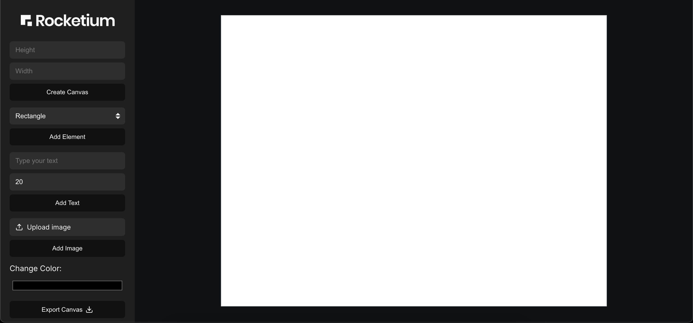

# Canvas Builder Web App

A full-stack web application that lets users create, customize, and export canvases using shapes, text, and images. Built with React.js and the HTML5 Canvas API on the frontend, and Node.js on the backend.

## Live Demo

** [View Deployed App on Vercel](https://rocketium-git-main-akash-vermas-projects-c299e195.vercel.app/)**  

## Project Structure

```bash
rocketium/
│
├── backend/
│   ├── controllers/
│   ├── routes/
│   ├── services/
│   ├── server.js
│   ├── package.json
│
├── frontend/
│   ├── src/
│   │   ├── components/
│   │   │   ├── assets/
│   │   │   │   ├── logo.png
│   │   │   │   ├── screenshot.png
│   │   │   ├── LiveCanvas.jsx
│   │   │   ├── SidebarPanel.jsx
│   │   │   ├── ExportButton.jsx
│   │   │   ├── CanvasInit.jsx
│   │   │   └── ImageUploader.jsx
│   │   ├── .env.local
│   │   ├── .env.production
│   │   ├── api.js
│   │   ├── App.js
│   │   ├── App.css
│   │   ├── index.js
│   │   └── index.css
│   ├── public/
│   └── package.json
│
├── .gitignore
└── README.md 
``` 

##  Tech Stack

### Frontend (React)
- React.js – Core frontend framework
- HTML5 Canvas API – Dynamic drawing and interactivity
- CSS Modules – Styling via SidebarPanel.css and App.css
- Lucide-react – Modern icons for Upload, Download, etc.

### Backend (Node.js + Express)
- Express.js – REST API backend
- Multer – For handling image uploads 
- CORS – Enables frontend-backend communication
- File system – Saving uploaded files in `/uploads` 

---

## Features

### Canvas Features
- Create canvas with **custom width and height**
- Add:
  - Rectangle
  - Circle
  - Text (with size control)
  - Image upload
- Pick and apply color
- Drag & Resize elements
- Delete elements via Backspace / Delete
- Reset everything by clicking the logo
- Export canvas as **PDF using jsPDF**

### How to Use Interactive Features

Element Selection:
- First, click on any element (Shape, Text, or Image) on the canvas to select it.

Resize:
- Use the corner handles (small blue boxes on edges) to drag and resize the selected element.

Change Color:
- After selecting the element, pick a new color from the color picker box in the sidebar to apply the color change in real-time

---

## Preview




## Author

Akash Verma  
Electrical Engineering  
B.Tech, IIT Jammu  
2022UEE0120@iitjammu.ac.in

